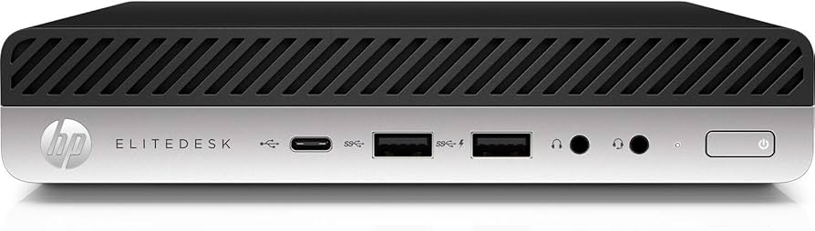
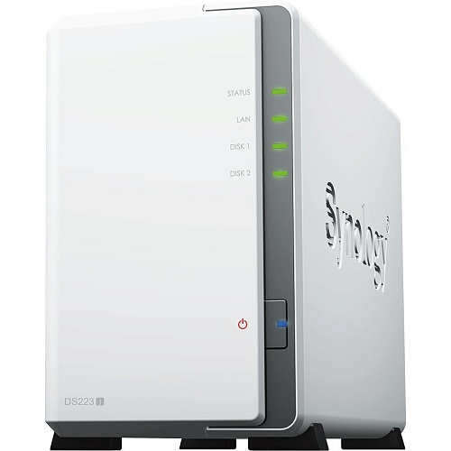

# 🏡 Домашний кластер Kubernetes + Proxmox = ❤️

Проект домашнего кластера Kubernetes на базе физических узлов, построенный для обучения, экспериментов и отработки навыков.

---

## 🧱 Аппаратная архитектура

### 🔹 Kubernetes кластер

Кластер состоит из трёх физических нод:

- **3× HP EliteDesk 800 G5 Desktop Mini**
  - CPU: Intel i5-8500T (6×2.1GHz)
  - RAM: 32 GB
  - OS: Talos Linux
  - Форм-фактор: Mini-PC, бесшумные и энергоэффективные

  

Дополнительное оборудование:

- **Synology DS223j**
  - Используется для shared volumes и CSI
  - Интеграция с кластером через Synology CSI Driver

  

---

### 🔹 Proxmox кластер

Отдельный кластер на базе Proxmox VE, используется для виртуализации и тестирования различных систем:

- **4× HP EliteDesk 800 G3 Desktop Mini**
  - CPU: Intel i5-6500T
  - RAM: 16 GB
  - OS: Proxmox VE 8.x
  - Используются как хосты для запуска VM и контейнеров (LXC)
  - локальные диски + сетевое хранилище **Synology DS223j**

  

Примеры использования:
- Развёртывание тестовых кластеров (K3s, MicroK8s)
- Тестирование альтернативных ОС (FreeBSD, Alpine, NixOS)
- CI/CD runners
- Тестовая среда для Ansible, Terraform

---

## ☸️ Kubernetes

- **Тип установки**: Talos
- **CNI**: Flannel
- **Storage**: RWO и RWX тома через Synology NAS
- **Monitoring**: Prometheus, Grafana

## 🔐 Безопасность и управление

- **Cert-Manager**: автоматическое обновление TLS-сертификатов
- **ExternalDNS**: динамическое управление DNS-записями (Cloudflare / Google DNS / другое)

## 📦 Приложения

Основные развернутые сервисы:

- [`homepage`](https://gethomepage.dev/): дашборд для управления сервисами
- `website`: личная страничка в сети
- [`n8n`](https://n8n.io/): автоматизация задач
- `Synology CSI`: подключение PVC к NAS
- [`NextCloud`](https://nextcloud.com/): организация домашнего файлообмена
- [`Minio`](https://min.io/): S3-совместимое хранилище

## 🌐 Сеть

- **Ingress Controller**: NGINX Ingress
- **Внешний доступ**: через внешний IP
- **DNS**: автоматическое создание записей через ExternalDNS
- **Let's Encrypt**: сертификаты через cert-manager

## 🔁 Резервное копирование

- Бэкапы приложений и etcd хранятся на Synology NAS
- Используется `Velero`, `Restic`, `rsync`

## 🚀 Зачем это всё

- Лаборатория для тестирования DevOps-практик
- Проверка Helm-чартов и CI/CD пайплайнов перед выкладкой в прод
- Отработка навыков работы с Kubernetes
- Освоение построения отказоустойчивой и безопасной инфраструктуры
- Создание собственного облака на базе Proxmox